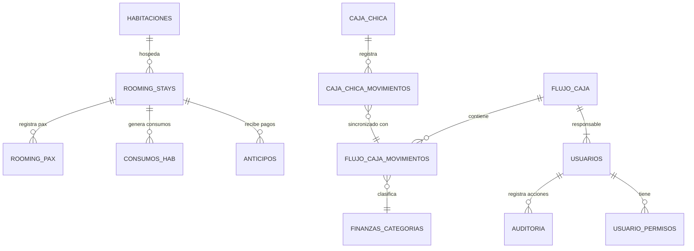

El sistema utiliza una base de datos **MySQL (MariaDB)** con un diseño relacional optimizado para la integridad financiera y la velocidad operativa.

## Diagrama Entidad-Relación (ERD)

Este diagrama representa cómo se conectan los módulos principales del hotel:

---

## Diccionario de Tablas Maestras

### 🏨 Operaciones (Core)

| Tabla | Propósito | Relación Clave |
| :--- | :--- | :--- |
| **`habitaciones`** | Catálogo físico de cuartos, tipos y estados (libre, ocupado, limpieza). | Primaria para `rooming_stays`. |
| **`rooming_stays`** | La tabla más importante. Gestiona el ciclo de vida del huésped (check-in/check-out). | Vincula Habitaciones y Usuarios. |
| **`rooming_pax`** | Repositorio de pasajeros (DNI, Nombre, Procedencia) vinculados a una estancia. | Dependiente de `rooming_stays`. |

### 💰 Finanzas y Contabilidad

| Tabla | Propósito | Lógica Crítica |
| :--- | :--- | :--- |
| **`flujo_caja`** | Cabecera de turnos de caja (Mañana/Tarde). | Control de estado (Borrador/Cerrado). |
| **`flujo_caja_movimientos`** | Detalle de ingresos y egresos multidivisa (`PEN`, `USD`, `CLP`). | Sincronización con Caja Chica. |
| **`caja_chica`** | Gestión del fondo de efectivo para gastos menores de recepción. | Cierre diario obligatorio. |

---

## Reglas de Integridad

1.  **Eliminación en Cascada**: Si se elimina una estancia (`rooming_stays`), se eliminan automáticamente sus pasajeros (`rooming_pax`) y consumos para evitar datos huérfanos.
2.  **Triggers de Auditoría**: El sistema registra automáticamente en la tabla `auditoria` cualquier cambio de estado en una habitación o cierre de turno financiero.
3.  **Unicidad de Turnos**: No se permite abrir dos turnos para la misma `fecha` y `turno` (Mañana/Tarde), evitando duplicidad de arqueos.

---

> [!TIP]
> Puedes descargar el archivo fuente completo para análisis en: [database.sql](https://github.com/jf2021070309/hotel/blob/main/database.sql)
